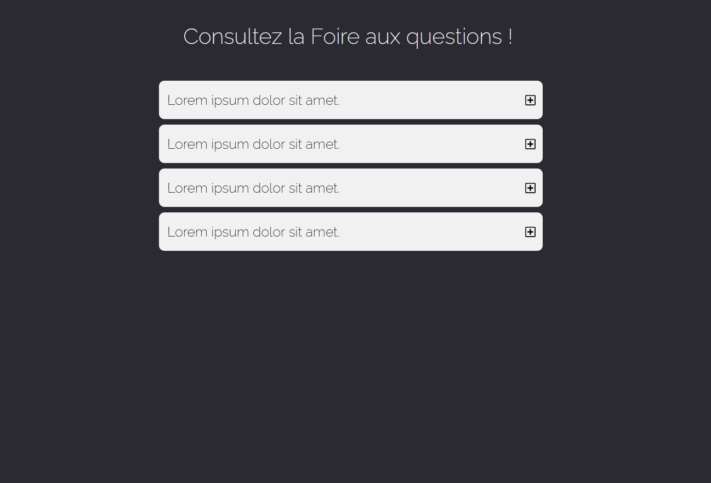
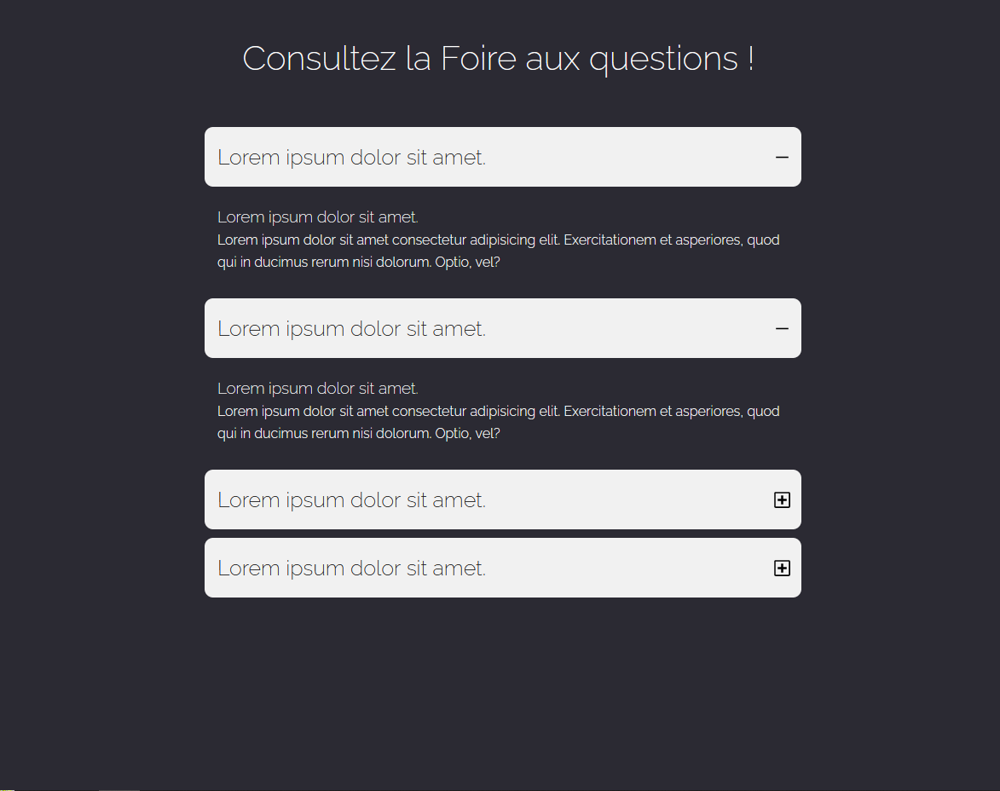

# nettoyage du HTML
Dans cet exercice, j'ai nettoyé le fichier index pour garder un code propre et sémantiques.

# Création du CSS

Dans cet exercice, j'ai crée le css pour que ca puisse ressembler à cette photo.

# Création du JS

Dans cet exercice, j'ai crée le JS pour que ca puisse ressembler à cette photo et que l'on puisse avoir cette animation quand on clique sur la petite croix (pour l'instant j'ai réussi).

 

[Cliquez ici pour voir plus de détails ](https://abdulrahman92c.github.io/projet_debogage/)